# Overview    
----------
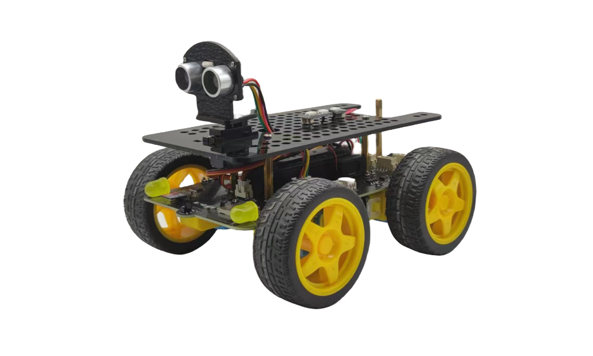    
This kit provides rich and detailed tutorial materials, very simple installation, many functions, and many interfaces reserved for users to expand by themselves, which is very suitable for DIY or electronics enthusiasts to learn and use.             

**Functional description**      
• Wifi, Web_App control.      
• Power display (Web_App).    
• 4 Motor drive (With LED car lights).           
• Speakers, MP3 players play songs.            
• SD card for storing songs, etc.          
• Touch music alarm.             
• Full color RGB LED.    
• Ultrasonic distance measurement.     
• Servo control ultrasonic module, etc.    
• Compatible with LEGO extensions.     
• IO ports are reserved to expand other functions.           
• With USB port charging function (5V).        

## Specification    
----------------
• Operating voltage: 3.3V   
• Maximum output power: 3.3V/2A  
• Charge current: 1A   
• Power of speaker: 8Ω/2W      
• Motor speed: 245rpm/6V     

## Interface   
------------
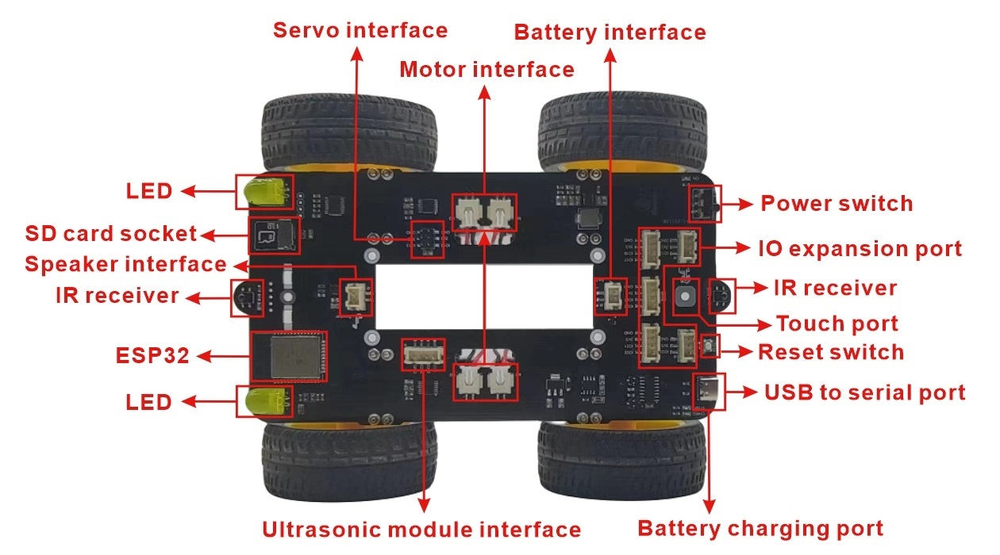

## Recommended battery specifications      
-------------------------------------
• Model: 18650 lithium battery (Button top)    
• Capacity: >2000mAh    
• Maximum charging voltage: 4.2V    
• Nominal voltage: 3.7V   
• End-off voltage: 2.75V    
• Minimum charging current: >1A     
• Minimum discharge current: >4A   
      

## Detailed list                
----------------
| eCar drive board | <a href="https://docs.mosiwi.com/en/latest/outsourcing/O1M0000_ultrasonic_module/O1M0000_ultrasonic_module.html" target="_blank">Ultrasonic module</a> | <a href="https://docs.mosiwi.com/en/latest/outsourcing/sg90_servo/sg90_servo.html" target="_blank">Servo</a> |     
| :--: | :--: | :--: |    
| 1PCS | 1PCS | 1PCS |    
| 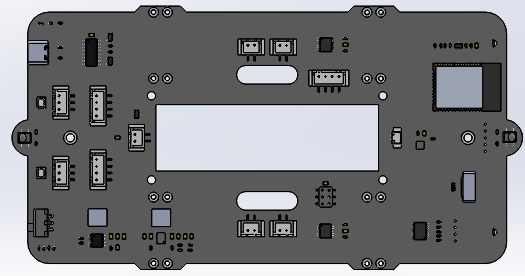 | 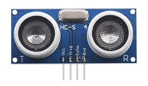 | 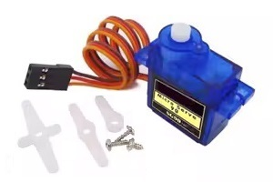 |  
| <a href="https://docs.mosiwi.com/en/latest/outsourcing/nec_ir_remote_control/nec_ir_remote_control.html" target="_blank">IR remote control</a> | RGB LED | Speaker |      
| 1PCS | 1PCS | 1PCS |    
|  | 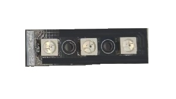 | 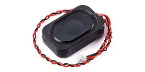 |      
| Acrylic board | Ultrasonic module fixing parts | TT Motor |      
| 1PCS | 1PCS | 4PCS |              
| 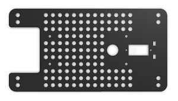 | 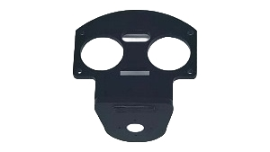 | 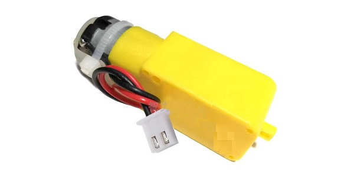 |     
| Motor fixed parts | Wheel | Battery case |      
| 4PCS | 4PCS | 1PCS |               
| 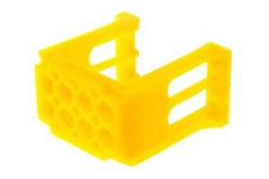 | 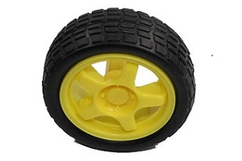 | 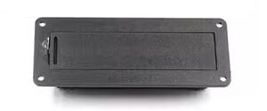 |     
| 3P XH2.54 cable | 4P XH2.54 cable | ZH1.25 to HX2.54 cable |      
| 1PCS | 1PCS | 5PCS |    
| 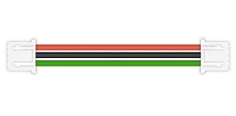 | 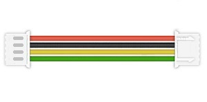 | 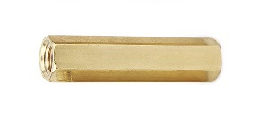 |     
| M3\*8mm round-head screw | M1.5\*8mm round-head screw | M1.5 nuts |     
| 9PCS | 22PCS | 22PCS |      
| 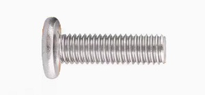 |  | 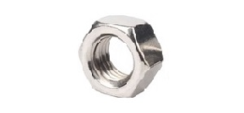 |    
| M2\*8mm round-head screw  | M2 nuts | M3\*15 dual-pass copper pillar |       
| 2PCS | 2PCS | 1PCS |    
|  |  | 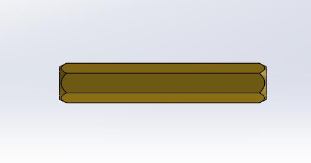 |   
| 1PCS | 1PCS | 1PCS |    
| 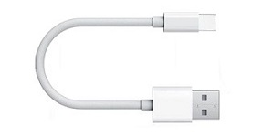 | 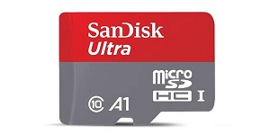 | 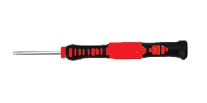 |      
  

```{tip}
Click on the name in the list to get detailed specifications!   
```

## Resource Download     
--------------------     
1. Schematic diagram: [Click me to download!](../_static/pdf/eCar_sch.PDF)   
