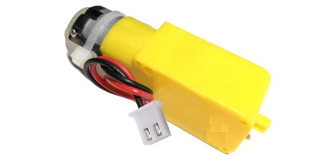
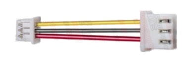
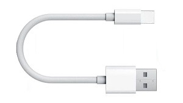

# Overview    
----------
    
This kit provides rich and detailed tutorial materials, very simple installation, many functions, and many interfaces reserved for users to expand by themselves, which is very suitable for DIY or electronics enthusiasts to learn and use.             

**Functional description:**      
• Web_App(Wifi) and infrared remote control.          
• 4 Motor drive (With LED car lights).           
• Speakers, MP3 players play songs (I2S).            
• SD card for storing songs, etc.          
• Touch music alarm.             
• Full color RGB LED.    
• Ultrasonic distance measurement.     
• Servo control ultrasonic module, etc.    
• Compatible with LEGO extensions.     
• IO ports are reserved to expand other functions.           
• With USB port charging function (5V).     
• With power display.         
• Repeatable programming and burning.           

## Functional diagram and specification  
---------------------------------------
      
    
• Main control chip: ESP32-WROOM-32E      
• System operating voltage: 3.3V        
• Operating voltage of IO port: 3.3V
• Maximum output power: 3.3V/2A   
• Maximum output power: 5V/2A 
• Maximum charge current: 5V/2A   
• Power of speaker: 8Ω/2W      
• Motor speed: 245rpm/6V     

## Recommended battery specification      
------------------------------------
• Model: 18650 lithium battery (Button top)    
• Capacity: >2000mAh    
• Maximum charging voltage: 4.2V    
• Nominal voltage: 3.7V   
• End-off voltage: 2.75V    
• Minimum charging current: >2A     
• Minimum discharge current: >4A   
      
     
```{tip}
It's easy to buy on amazon, ebay, or AliExpress.            
```

## Detailed list                
----------------
| eCar drive board | <a href="https://docs.mosiwi.com/en/latest/outsourcing/O1M0000_ultrasonic_module/O1M0000_ultrasonic_module.html" target="_blank">Ultrasonic module</a> | <a href="https://docs.mosiwi.com/en/latest/outsourcing/sg90_servo/sg90_servo.html" target="_blank">Servo</a> |     
| :--: | :--: | :--: |    
| 1PCS | 1PCS | 1PCS |    
|  |  |  |  
| <a href="https://docs.mosiwi.com/en/latest/outsourcing/nec_ir_remote_control/nec_ir_remote_control.html" target="_blank">IR remote control</a> | RGB LED | Speaker |      
| 1PCS | 1PCS | 1PCS |    
|  |  |  |      
| Acrylic board | Ultrasonic module fixing parts | TT Motor |      
| 1PCS | 1PCS | 4PCS |              
|  |  |  |     
| Motor fixed parts | Wheel | Battery case |      
| 4PCS | 4PCS | 1PCS |               
|  |  |  |     
| ZH1.25 to HX2.54 cable | 4P XH2.54 cable | Servo shaft |      
| 1PCS | 1PCS | 1PCS |    
|  |  |  |     
| M3x8mm round-head screw | M1.6x6mm round-head screw | M2x8mm round-head screw |     
| 8PCS | 21PCS | 2PCS |        
|  |  |  |      
| M1.6 nuts  | M2 nuts | M3x30 dual-pass copper pillar |       
| 4PCS | 2PCS |   |    
|  |  |   |  
| M1.6 nuts  | Latch | M3x30 dual-pass copper pillar |       
|   | 2PCS | 4PCS |    
|   |  |  |     
| Type C USB cable  | Micro SD card | Phillips Screwdriver |   
| 1PCS | 1PCS | 1PCS |    
|  |  |  |      
  

```{tip}
Click on the name in the list to get detailed specifications!   
```

## Hardware resources download     
------------------------------       
1. PCB diagram: [Click me to download!](../_static/pdf/eCar_pcb.PDF)  
2. PCB CAD file: [Click me to download!](../_static/3d/eCar.DXF)      
3. Schematic diagram: [Click me to download!](../_static/pdf/eCar_sch.PDF) 
4. ESP32-WROOM-32E datasheet: [Click me to download!](../_static/pdf/esp32-wroom-32e_esp32-wroom-32ue_datasheet_en.pdf)     
5. 3D acrylic_board: [Click me to download!](../_static/3d/Acrylic_board.STL)         
6. 3D ultrasonic module bracket: [Click me to download!](../_static/3d/Ultrasonic_module_bracket.STL)    