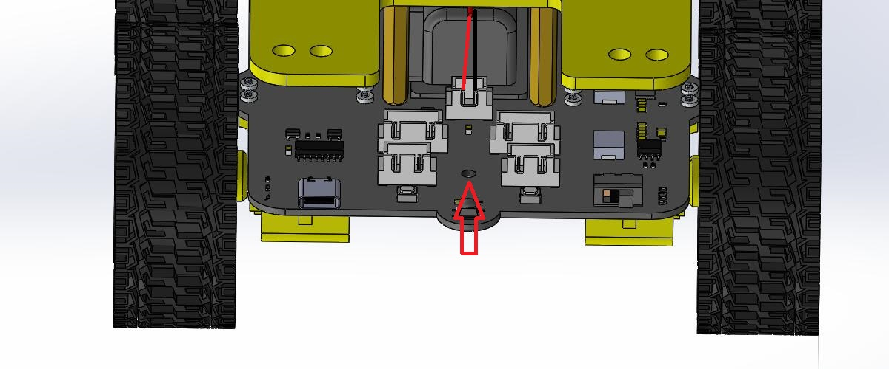
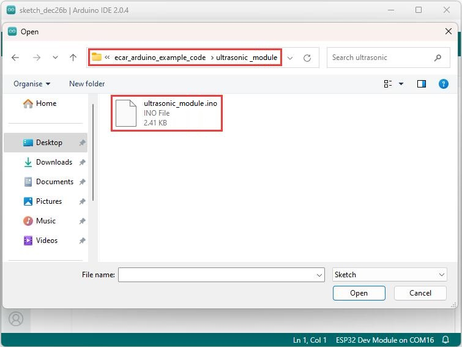
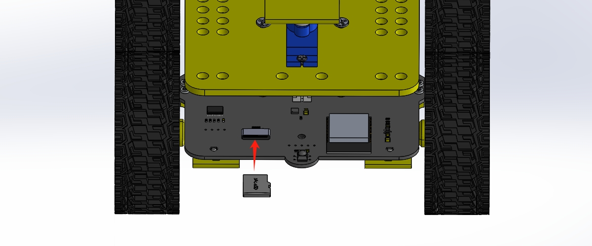
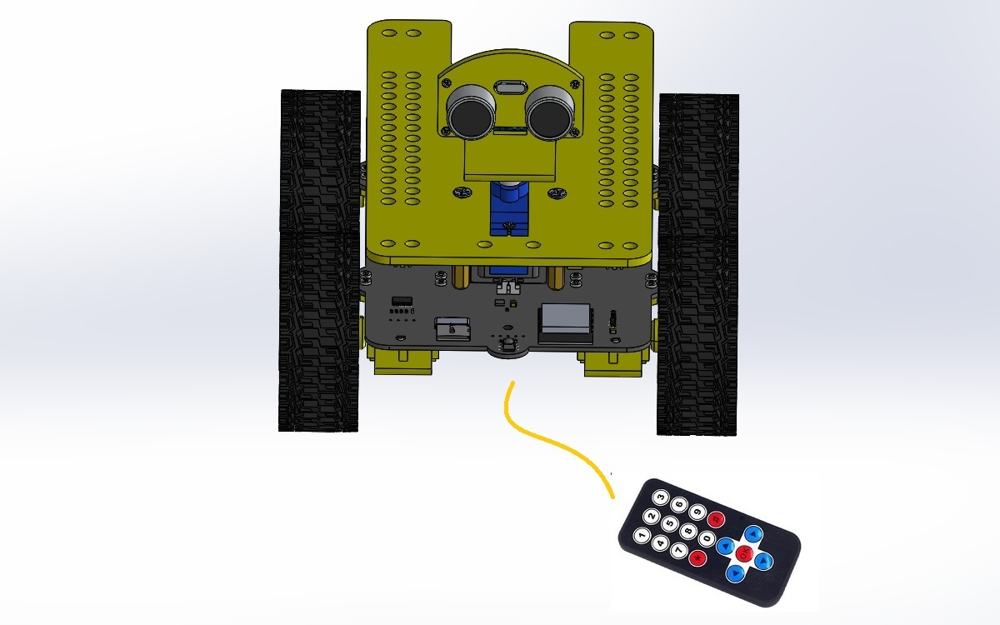
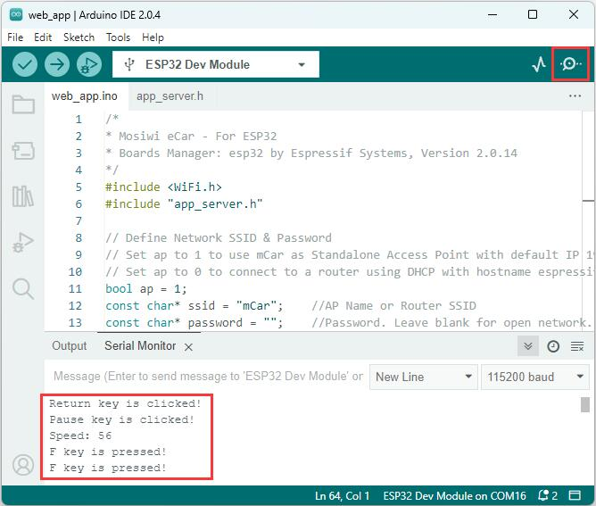

# Arduino_tutorial   
------------------

```{note}
The following will override the ESP32 factory default code!     
```   

Tools:     
1. PC(Win10 or uper)     
2. Type C USB cable 

## Install the CH340 driver:      
----------------------------     
<a href="https://docs.mosiwi.com/en/latest/various_resources/ch340/ch340_driver.html" target="_blank">Click me</a>
```{tip}
If you've already done this step, you can skip it!           
``` 

## Install the Arduino IDE                  
--------------------------        
<a href="https://docs.mosiwi.com/en/latest/arduino/resources/arduino_ide/arduino_ide.html" target="_blank">Click me</a>       
```{tip}
If you've already done this step, you can skip it!   
```

## Installing libraries                 
-----------------------                           
1. Download the library file and unzip it.   
[Click me to download!](../_static/arduino_tutorial/libraries/ecar_arduino_libraries.rar)      

```{tip}
The library files downloaded above are tested by us, they may not be the latest library files!       
```   

2. Install the library files downloaded above into the Arduino IDE.             
Refer to: <a href="https://docs.mosiwi.com/en/latest/arduino/resources/arduino_libraries/arduino_libraries.html#installing-libraries" target="_blank">Link</a>             
       

Latest library resources（option）:      
ESP32-audioI2S-master: <https://github.com/schreibfaul1/ESP32-audioI2S>    
ESP32Servo: <https://madhephaestus.github.io/ESP32Servo/annotated.html>    
IRremote: <https://github.com/Arduino-IRremote/Arduino-IRremote>    

## Configure the Arduino IDE for ESP32       
--------------------------------------               
1. Open the arduino IDE，click "File" > "Preferences"，as shown below:      
    

2. Open the button marked below:   
    

3. Copy the link：

```
https://espressif.github.io/arduino-esp32/package_esp32_index.json
```  
4. Paste it inside and click OK, as shown below:    
   

5. Click "Boards Manager":   
   

6. Find the ESP32 from the pop up Boards Manager and then click install.   
           
```{tip}
It is recommended to install version 2.0.14, which we are using!            
```  

7. Click "Tools" > "Board" > "esp32" to choose the "ESP32 Dev Module".      
     

8. ESP32 parameter Settings.     
      
```{note}
All the following project code needs to be set according to the above parameters, or you will get an error!                   
```     

## Project     
----------     
**Download the example code:**       
[Click me to download!](../_static/arduino_tutorial/example_code/ecar_arduino_example_code.zip)     

### 1_Touch          
1. Open the "touch" example code:         
 

2. Select board type:    
       

3. Select COM port:          
 
```{note}
The CH340 driver must be installed, otherwise the COM port cannot be found!              
``` 

4. ESP32 parameter Settings:     
     

5. Upload the code:     
      

6. Open the serial monitor and select the baud rate:      
    

7. Result:         
       
Click the touch stick of eCar, and the serial port monitor displays the data.       
       

**Code analysis:**       
1. Initialize the serial port baud rate to 115200:  
```
Serial.begin(115200);
```

2. After printing serial port data, no line breaks:       
```
Serial.print("T2(IO2) = ");    
```

3. After printing touch data on the serial port, newline:       
```
Serial.println(touchRead(T2));     
```

4. Initialize the touch interrupt:    
```
// For tuch T2(IO02).
touchAttachInterrupt(T2, gotTouchT2, threshold);
```

5. Define the touch interrupt mode:     
```
// Touch ISR will be activated when touchRead is lower than the Threshold
touchInterruptSetThresholdDirection(testingLower);
```

6. Touch interrupt function:      
```
// Interrupt function for touch T2(IO02).
void gotTouchT2(){
  if (lastTouchActive != testingLower) {
    touchActive = !touchActive;
    testingLower = !testingLower;
    // Touch ISR will be inverted: Lower <--> Higher than the Threshold after ISR event is noticed
    touchInterruptSetThresholdDirection(testingLower);
  }
}
```

### 2_Ultrasonic_module        
1. Open the "ultrasonic_module" example code and upload it to eCar:           
       

2. Result:    
The serial port monitor prints the distance measured by the ultrasonic module.        
     

**Code analysis:**     
1. Define a thread.   
```
//Define the first thread 
xTaskCreate(
TASK_ONE,          // Task function
"TaskOne",         // Task name
32*1024,           // Stack size, set as needed
NULL,              
1,                 // priority
&TASK_HandleOne    // Task handle
);
```

2. Thread function, which runs in parallel with loop():    
```
// The function body of task1, since the input parameter is NULL, 
// so the function body needs to be void * parameter, otherwise an error is reported.
void TASK_ONE(void *param ){
  for(;;){
    ...
  }
  // When the thread terminates, the thread resource is released.
  //Serial.println("Ending TaskOne!");
  //vTaskDelete( TASK_HandleOne );
}
```

3. Generate a 10 microsecond high level trigger signal to the ultrasonic module:      
```
// trig 10us
digitalWrite(trigPin, HIGH);
delayMicroseconds(10);
digitalWrite(trigPin, LOW);
```

4. Read the high level time generated by the ECHO pin of the ultrasonic module, which is equal to the transmission time of the sound wave:        
```
// Calculate the time of the ultrasonic echo
while(digitalRead(echoPin) == LOW){
    delayMicroseconds(10);
    if(T > 10000){ break; }  // About 100 milliseconds.
    T++;
}
T = 0;
while(digitalRead(echoPin) == HIGH){
    delayMicroseconds(10);
    if(T > 10000){ break; }  // About 100 milliseconds.
    T++;
}
```

5. Calculate the distance of the object
```
long dis = T * (10 + readEchoPinErr) * 0.034 / 2;
```    

More information about ultrasonic module: <a href="https://docs.mosiwi.com/en/latest/outsourcing/O1M0000_ultrasonic_module/O1M0000_ultrasonic_module.html" target="_blank">Link</a>       

### 3_Servo       
1. Open the "servo" example code and upload it to eCar:           
       

2. Result:    
Servo cycle 0--180 degrees, 180--0 degrees swing.       
       

**Code analysis:**       
1. Include the servo drive library into the code.    
```
#include <ESP32Servo.h>    
```   

2. Initialize the two servos:     
```
// Allow allocation of all timers
ESP32PWM::allocateTimer(0);
ESP32PWM::allocateTimer(1);
ESP32PWM::allocateTimer(2);
ESP32PWM::allocateTimer(3);
myAservo.setPeriodHertz(50);  // Standard 50hz servo
myBservo.setPeriodHertz(50);  // Standard 50hz servo

// attaches the servo on pin to the servo object
// using SG90 servo min/max of 500us and 2400us
// for MG995 large servo, use 1000us and 2000us,
// which are the defaults, so this line could be
// "myservo.attach(servoPin);"
myAservo.attach(AservoPin, 500, 2400);   
myBservo.attach(BservoPin, 500, 2400);  
myAservo.write(90);
myBservo.write(90);
```

3. Set the Angle of the two servos to 90 degrees:           
```
myAservo.write(90);
myBservo.write(90);
```    

More information about servo: <a href="https://docs.mosiwi.com/en/latest/outsourcing/sg90_servo/sg90_servo.html" target="_blank">Link</a>    

### 4_RGB_LED      
A WS2812 RGB LED module is used on eCar to generate different colors of light.          

1. Open the "RGB_LED" example code and upload it to eCar:           
       

2. Result:    
RGB LEDs first produce white light, and then cycle through to produce red, green, and blue light.         
  

**Code analysis:**      
1. An array that stores color values. The value range is: 0-255, corresponding to green, red, and blue respectively.    
```
int color[] =  {0x55, 0x11, 0x77};  // RGB value: G, R, B
```

2. The color value is converted to the WS2182 color value to be displayed and only one RGB LED is lit.    
```
int i=0, led, col, bit;
for (led=0; led<NR_OF_LEDS; led++) {
  for (col=0; col<3; col++ ) {
    for (bit=0; bit<8; bit++){
      if ( (color[col] & (1<<(7-bit))) && (led == RGBled_index) ) {
        led_data[i].level0 = 1;
        led_data[i].duration0 = 8;
        led_data[i].level1 = 0;
        led_data[i].duration1 = 4;
      } else {
        led_data[i].level0 = 1;
        led_data[i].duration0 = 4;
        led_data[i].level1 = 0;
        led_data[i].duration1 = 8;
      }
      i++;
    }
  }
}
```

3. Send data to WS2812.   
```
rmtWrite(rmt_send, led_data, NR_OF_ALL_BITS);   
```

### 5_SD_card      
1. Insert the SD card into the eCar.      
      

2. Open the "SD_card" example code and upload it to eCar:           
       

3. Result:      
Print all the contents in the root directory of the SD card on the serial monitor.     
     

**Code analysis:**       
1. Initialize the SPI port.    
```
pinMode(SD_CS, OUTPUT);
digitalWrite(SD_CS, HIGH);
SPI.begin(SPI_SCK, SPI_MISO, SPI_MOSI);
``` 

2. Initialize the SD card.    
```
if(!SD.begin(SD_CS)){
    Serial.println("Card Mount Failed");
    return;
}
```

3. Call "listDir" function to print all the contents in the root directory of the SD card on the serial monitor.       
```
listDir(SD, "/", 0);
```

More information about SPI communication protocol: <a href="https://docs.mosiwi.com/en/latest/various_resources/spi/spi.html" target="_blank">Link</a>  

### 6_Speaker     
1. Open the "speaker" example code and upload it to eCar:           
       

2. Result:         
The speaker produces 440 Hz sound all the time.             
    

**Code analysis:**        
1. Initialize the I2S master.       
```
if (!I2S.begin(mode, sampleRate, bps)) {
Serial.println("Failed to initialize I2S!");
while (1); // do nothing
}
```

1. Send data to the I2S slave.      
```
I2S.write(sample);    
```

### 7_MP3_player       
1. Insert the SD card into the eCar.      
   

2. Open the "mp3_player" example code and upload it to eCar:           
       

3. Result:    
    

**Code analysis:**        
1. Define a 2-dimensional array to store the song names in the SD card.                
```
char songs[][40]={
  "1_Free Loop.mp3",
  "2_Dream It Possible.mp3",
  "3_We Are The Brave.mp3",
  "4_My stupid heart.mp3",
  "5_She.mp3",
  "6_Big Big World.mp3",
  "7_My Love.mp3",
  "8_Hero.mp3",
  "9_Home.mp3",
  "10_I Got You.mp3",
  "11_Just One Last Dance.mp3",
  "12_Peaches.mp3",
  "13_Valder Fields.mp3",
  "14_You Raise Me Up.mp3"
};
```
```{note}
The song names in the 2-dimensional array must be the same as the song names in the SD card, otherwise the songs cannot be played!        
``` 

2. Initialize the I2S master.                    
```
audio.setPinout(I2S_BCLK, I2S_LRC, I2S_DOUT);        
```

3. Set volume.
```
audio.setVolume(21);   // 0...21   
```

4. Play the song.
```
audio.connecttoFS(SD, songs[songIndex]);   
```

5. Read the remaining time for the currently playing song.       
```
int t = audio.getAudioFileDuration(); 
```

6. Pause and play the song.     
```
audio.pauseResume();   
```

7. Stop playing the song.    
```
udio.stopSong();    
```

**More Code Examples: ** 
     


### 8_IRremote     
1. Open the "IRremote" example code and upload it to eCar:           
       

2. Result:      
Open the serial monitor of Arduino IDE, press the button on the infrared remote control, and the serial monitor prints different values.         
       

**Code analysis:**        
1. Initialize the IR receiver.       
```
IrReceiver.begin(irPin);    
```

2. Determine whether infrared data is received.           
```
if (IrReceiver.decode()){
    ...
}   
```  

3. The next infrared data is allowed to be received.    
```
IrReceiver.resume();   
```  

More information about IR receiver: <a href="https://docs.mosiwi.com/en/latest/common/C1S0001_ir_receiver/C1S0001_ir_receiver.html" target="_blank">Link</a>   
More information about IR remote control: <a href="https://docs.mosiwi.com/en/latest/outsourcing/nec_ir_remote_control/nec_ir_remote_control.html" target="_blank">Link</a>     

### 9_Motor     
1. Open the "motor" example code and upload it to eCar:           
       

2. Result:       
eCar keeps looping forward, stop, back, stop, turn left, stop, turn right, stop.     
    

**Code analysis:**        
1. Initialize the I2C master.          
```
i2cMotorInit();      
```
More information about arduino I2C: <a href="https://www.arduino.cc/reference/en/language/functions/communication/wire/" target="_blank">Link</a>       
More information about I2C communication protocol: <a href="https://docs.mosiwi.com/en/latest/various_resources/iic/iic.html" target="_blank">Link</a>    

2. Select the motor and set its rotation direction and speed.                  
```
// Description: Set motor speed and steering.
// Parameters:  Motor: 0-3 --> M1-M4
//              direction: 0=CCW, 1=CW  
//              speed: 0-99
void SetMotor(char motor, char direction, char speed){
  ...
} 
```  

3. eCar runs forward.       
```
CarRunForword(carSpeed);    
```

4. eCar runs backwards.           
```
CarRunBack(carSpeed);       
```

5. eCar turns left.           
```
CarTurnLeft(carSpeed);        
```

6. eCar turns right.         
```
CarTurnRight(carSpeed);       
```

7. eCar stop.           
```
CarStop();       
```

### 10_WEB_app       
1. Open the "web_app" example code and upload it to eCar:           
       

2. The phone searches and connects to mCar's wifi.       
     

```{tip}
After connecting to Wifi, your phone may pop up a window saying it cannot connect to the network, please ignore it!          
```  

3. Open your phone's browser and link to it by typing **"192.168.4.1"** in the address bar.    
    

4. The following screen should appear in your browser.      
 

5. Result:       
Open the serial monitor of Arduino IDE, click or press the button on the Web App, and the serial monitor prints different values.             
     

| Button | Serial port monitor display |    
| :--: | :-- |
| Left display window | Left display window |  
| Right display window | right display window |     
| P: xxx% | P: 100% |    
| F | F key is pressed! |   
| B | B key is pressed! |  
| L | L key is pressed! |  
| R | R key is pressed! |  
| P | P key is pressed! |     
| Speed | Speed: xxx |   
| Light | Light: xxx |     
| Aservo | Aservo: xxx | 
| Bservo | Bservo: xxx |   
| Volt +/- | Volume: xx |   
| < | Return key is clicked! |  
| \|\|< | Pause key is clicked! | 
| > | Next key is clicked! | 
| A | A key is clicked! | 
| S | S key is clicked! | 
| C | C key is clicked! | 

**Code analysis:**        
1. Set the working mode of ESP32, 1 is AP mode and 0 is Station mode.     
```
bool ap = 1;    
```

2. In AP (Access Point) mode, it sets its own Wifi name. In Station mode, set the name of the WiFi to connect to.               
```
const char* ssid = "mCar";          
```

3. In AP (Access Point) mode, it sets its own Wifi password. In Station mode, set the WiFi password to connect to. If password is empty, no password is required.                                 
```
const char* password = "";   
```  

4. Enable http server function of ESP32 module.            
```
startCarServer();        
```

5. Let the three display windows of WEB_App display different strings.           
```
displayWindow(0, "Left display window");
displayWindow(1, "right display window");
displayWindow(2, "P: 100%");      
```

### 11_eCar      
The function of this code is the same as the function of eCar out of the factory, which is also the integration of the above project function, so no more parsing code!           


## Other Resources (option)     
---------------------------        
<a href="https://docs.mosiwi.com/en/latest/arduino/A1D0000_uno_r3/A1D0000_uno_r3.html#arduino-programming-language" target="_blank">Arduino programming language</a>       

<a href="https://docs.mosiwi.com/projects/c1k0000/en/latest/" target="_blank">Arduino Getting Started Learning Kit</a>     

--------
**End!**    


