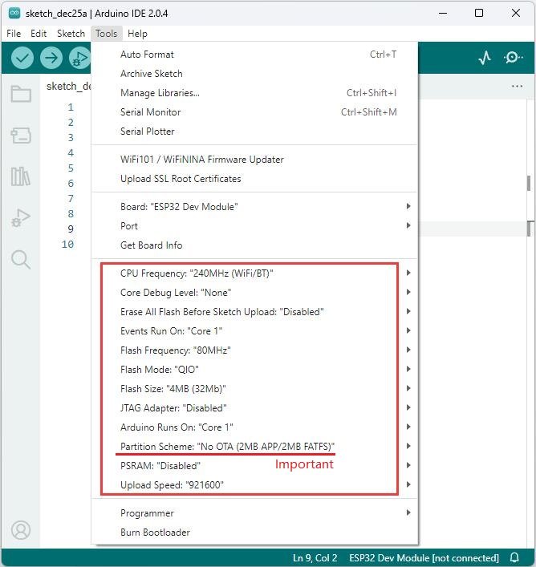

# Arduino_tutorial   
------------------
```{tip}
eCar factory default burning Arduino web app code, you can control it through the mobile browser after installing eCar!     
```

## Assembly        
-----------   
Go to the installation documentation: [Click me](../assembly/assembly.md)     

## Play eCar    
------------       
eCar factory default code can be controlled in two ways: IR remote control and Web app control.     

### IR remote control    
1. Turn the power switch ON the eCar to the "ON" state.     
   
2. [Make sure the infrared remote control has batteries installed.](https://docs.mosiwi.com/en/latest/outsourcing/nec_ir_remote_control/nec_ir_remote_control.html#cr2025-3v-lithium-manganese-battery)       

3. Now you can control mCar!    
 
| Button | Function |    
| :--: | :-- |  
| 0 - 9 | Play different songs. |   
| # | Play or pause the song. |       
| * | Turn on or off the LED light. |       
| ▲ | Forward |      
| ▼ | Backward |      
| ◀ | Turn left |    
| ▶ | Turn right |    
| OK | Stop |    

### Web app control
1. Turn the power switch ON the eCar to the "ON" state.    

2. The phone searches and connects to mCar's wifi.       

3. Open your phone's browser and link to it by typing **192.168.4.1** in the address bar.    

4. The following screen should appear in your browser, and now you can control mCar!     
   
| Button | Function |    
| :--: | :-- |
| Left display window | Displays the name of the song. |  
| Right display window | Display the distance measured by the ultrasonic module. |     
| P: xxx% | Displays the battery level. |    
| F | Press the button, the car forward; Release the button and the car stop. |   
| B | Press the button, the car backward; Release the button and the car stop. |  
| L | Press the button, the car turn left; Release the button and the car stop. |  
| R | Press the button, the car turn right; Release the button and the car stop. |  
| P | Press the button, the horn will sound; release the button and the horn will stop. |     
| Speed | Adjust the speed of the car. |   
| Aservo | Adjust the Angle of the ultrasound. |  
| Bservo | Reserved, if the servo2 interface is connected to the servo, its Angle can be controlled. |   
| Volt +/- | Control the volume of the speaker. |   
| < | Returns the last song. |  
| \|\|< | Play or pause the song. | 
| > | Switch to the next song. | 
| A | Turn RGB LED flashing on or off. | 
| S | Turn on or off the ultrasonic measuring distance. | 
| C | Reserve | 

## Component function learning      
------------------------------
```{note}
The following will override the ESP32 factory default code!     
```
Tools:     
1. PC(Win10 or uper)     
2. Type C USB cable 
               
### Install the Arduino IDE:    
[Click me](https://docs.mosiwi.com/en/latest/arduino/resources/arduino_ide/arduino_ide.html)     

### Configure the Arduino IDE for ESP32:    
1. Open the arduino IDE，click "File" > "Preferences"，as shown below:      
    

2. Open the button marked below:   
    

3. Copy the link：

```
https://espressif.github.io/arduino-esp32/package_esp32_index.json
```  
4. Paste it inside and click OK, as shown below:    
   

5. Click "Boards Manager":   
   

6. Find the ESP32 from the pop up Boards Manager and then click install.   
   

7. Click "Tools" > "Board" > "esp32" to choose the "ESP32 Dev Module".      
     

### Installing libraries:      
1. Install "ESP32Servo" library:
    

2. Install "IRremote" library:    
     

3. Install "ESP32-audioI2S" library:  


### Download the example code:       
      
### Project_1     
LEDs  

### Project_2     
Motors  

### Project_3     
Tuch  

### Project_4     
RGB LED   

### Project_5     
Servo   

### Project_6     
Ultrusonic     

### Project_7     
SD card         

### Project_8     
Speak   

### Project_9     
Wifi   

### Project_10     
eCar    

## Restore factory function


## Other Resources (option)     
---------------------------
[Arduino programming language (option)](https://docs.mosiwi.com/en/latest/arduino/A1D0000_uno_r3/A1D0000_uno_r3.html#arduino-programming-language)     
     

--------
**End!**    


