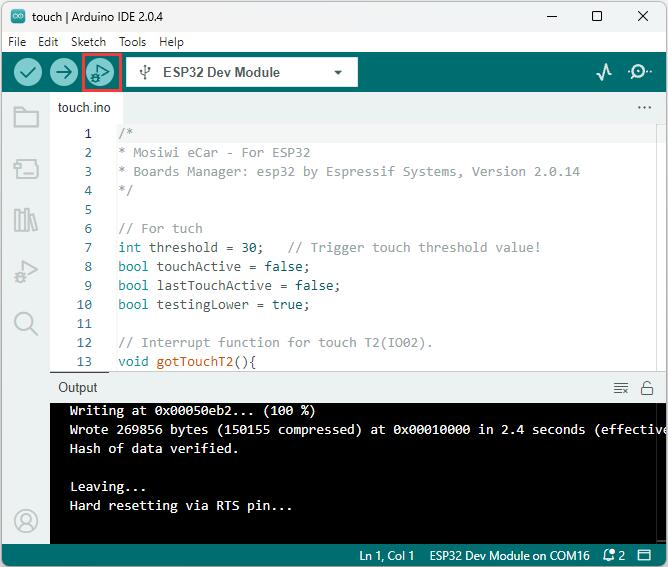

# Arduino_tutorial   
------------------

```{note}
The following will override the ESP32 factory default code!     
```   

Tools:     
1. PC(Win10 or uper)     
2. Type C USB cable 

## Install the CH340 driver:      
----------------------------     
<a href="https://docs.mosiwi.com/en/latest/various_resources/ch340/ch340_driver.html" target="_blank">Click me</a>
```{tip}
If you've already done this step, you can skip it!           
``` 

## Install the Arduino IDE                  
--------------------------        
<a href="https://docs.mosiwi.com/en/latest/arduino/resources/arduino_ide/arduino_ide.html" target="_blank">Click me</a>       
```{tip}
If you've already done this step, you can skip it!   
```

## Installing libraries                 
-----------------------                           
1. Download the library file and unzip it.   
[Click me to download!](../_static/arduino_tutorial/libraries/ecar_arduino_libraries.rar)      

```{tip}
The library files downloaded above are tested by us, they may not be the latest library files!       
```   

2. Install the library files downloaded above into the Arduino IDE.             
Refer to: <a href="https://docs.mosiwi.com/en/latest/arduino/resources/arduino_libraries/arduino_libraries.html#installing-libraries" target="_blank">Link</a>             
       

Latest library resources（option）:      
ESP32-audioI2S-master: <https://github.com/schreibfaul1/ESP32-audioI2S>    
ESP32Servo: <https://madhephaestus.github.io/ESP32Servo/annotated.html>    
IRremote: <https://github.com/Arduino-IRremote/Arduino-IRremote>    

## Configure the Arduino IDE for ESP32       
--------------------------------------               
1. Open the arduino IDE，click "File" > "Preferences"，as shown below:      
    

2. Open the button marked below:   
    

3. Copy the link：

```
https://espressif.github.io/arduino-esp32/package_esp32_index.json
```  
4. Paste it inside and click OK, as shown below:    
   

5. Click "Boards Manager":   
   

6. Find the ESP32 from the pop up Boards Manager and then click install.   
           
```{tip}
It is recommended to install version 2.0.14, which we are using!            
```  

7. Click "Tools" > "Board" > "esp32" to choose the "ESP32 Dev Module".      
     

8. ESP32 parameter Settings.     
      
```{note}
All the following project code needs to be set according to the above parameters, or you will get an error!                   
```     

## Project     
----------     
**Download the example code:**       
[Click me to download!](../_static/arduino_tutorial/example_code/ecar_arduino_example_code.zip)     

### 1_Touch        
1. Open the "touch" example code:         
 

2. Select board type:    
       

3. Select COM port:          
 
```{note}
The CH340 driver must be installed, otherwise the COM port cannot be found!              
``` 

4. ESP32 parameter Settings:     
     

5. Upload the code:     
      

6. Open the serial monitor and select the baud rate:      
    

7. Result:         
 
Click the touch stick of eCar, and the serial port monitor displays the data.       
       

**Code analysis:**       

1. Start the serial port:  
```
Serial.begin(115200);
```

2. After printing serial port data, no line breaks:       
```
Serial.print("T2(IO2) = ");    
```

3. After printing touch data on the serial port, newline:       
```
Serial.println(touchRead(T2));     
```

4. Initialize the touch interrupt:    
```
// For tuch T2(IO02).
touchAttachInterrupt(T2, gotTouchT2, threshold);
```

5. Define the touch interrupt mode:     
```
// Touch ISR will be activated when touchRead is lower than the Threshold
touchInterruptSetThresholdDirection(testingLower);
```

6. Touch interrupt function:      
```
// Interrupt function for touch T2(IO02).
void gotTouchT2(){
  if (lastTouchActive != testingLower) {
    touchActive = !touchActive;
    testingLower = !testingLower;
    // Touch ISR will be inverted: Lower <--> Higher than the Threshold after ISR event is noticed
    touchInterruptSetThresholdDirection(testingLower);
  }
}
```

### 2_Ultrasonic     

### 3_Servo       

### 4_RGB_LED      

### 5_SD_card      

### 6_Speaker     

### 7_MP3_player     

### 8_IRremote     

### 9_Motor     

### 10_WEB_app     

### 11_eCar  
eCar    


## Other Resources (option)     
---------------------------        
<a href="https://docs.mosiwi.com/en/latest/arduino/A1D0000_uno_r3/A1D0000_uno_r3.html#arduino-programming-language" target="_blank">Arduino programming language (option)</a>      


--------
**End!**    


