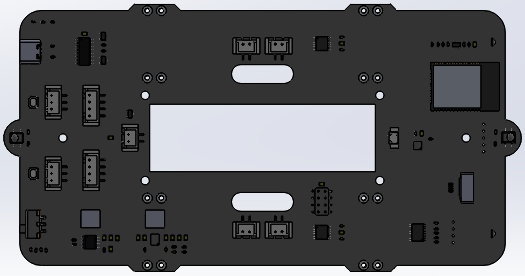
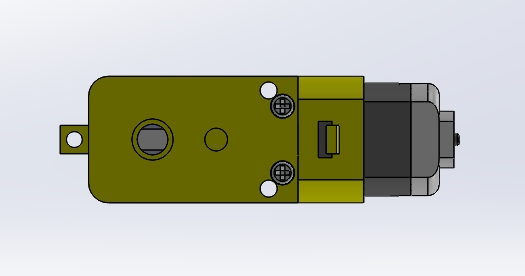
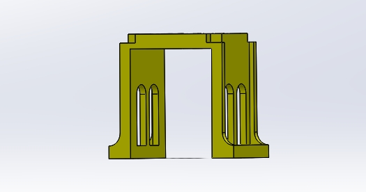
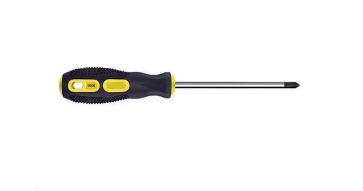

# Assembly_tutorial  
-------------------
```{note}
Please refer to the tutorial to burn the code before assembly, otherwise the server cannot be initialized! 
```             

Step1
-----    
Prepare tools and components:
| PCB board | TT motors 4Pcs | Motor bracket 4Pcs |     
| :--: | :--: | :--: |    
|  |  |  |   
| Wheels 4Ps | Screwdriver |  |
|  |  |  |


Step2
----- 


Step3
----- 


Step4
----- 

Step5
----- 

Step6
----- 

Step7
----- 

 
```{tip}
Please wait for us to update the assembly tutorial! 
```  

