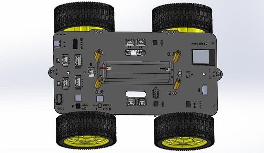
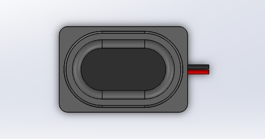
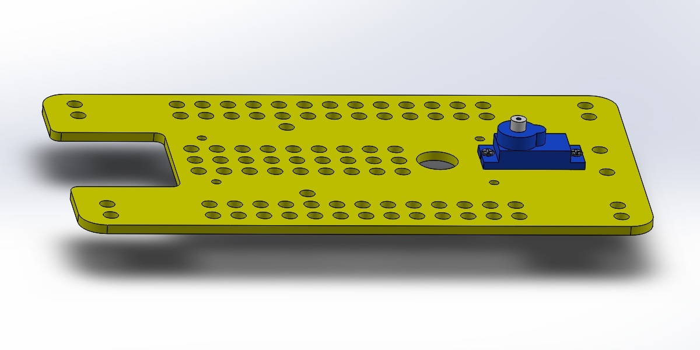
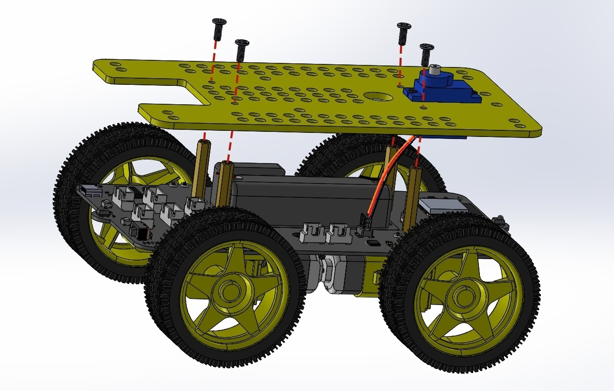
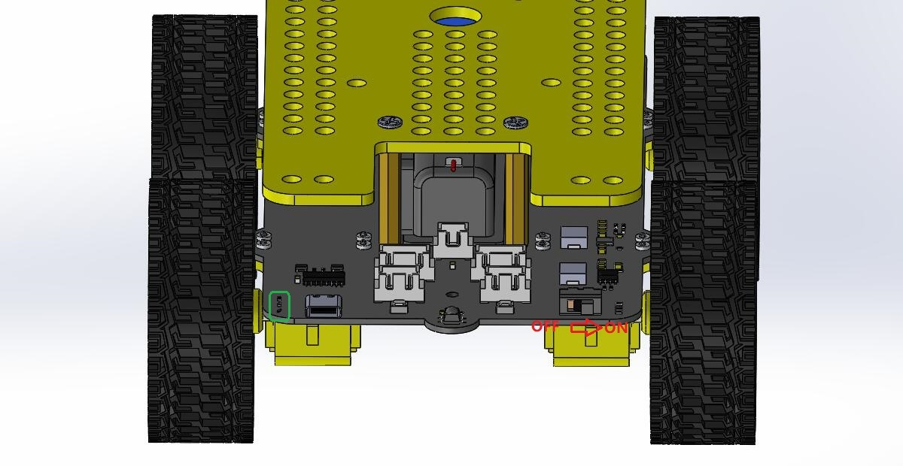
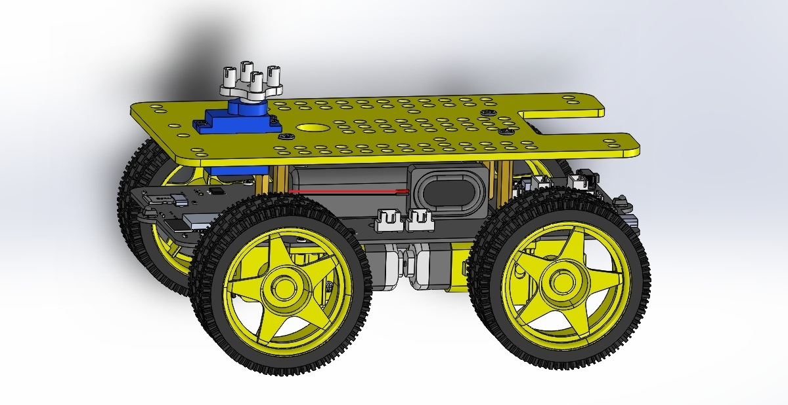
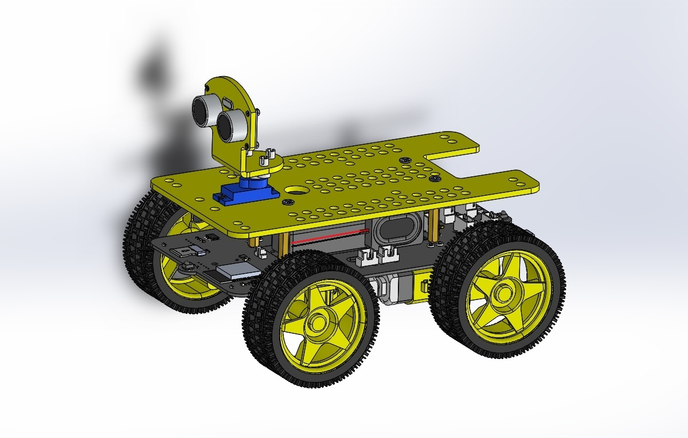

# Assembly_tutorial  
-------------------
```{note}
After unpacking the product, the product has its own factory program, which can be used to assemble the product, please do not burn the program to the motherboard before assembly!     
If you have burned other programs to the motherboard, please refer to the ["Restore Factory Functionality"](../restore_factory_function/restore_factory_function.md) section to burn factory programs!  
```             

Step1 installation and wiring of motors
---------------------------------------    
Prepare tools and components:
| PCB board | TT motors 4Pcs | Motor bracket 4Pcs |     
| :--: | :--: | :--: |    
|  |  |  |   
| M1.6x6mm screw 16Pcs | Screwdriver |  |
|  |  |  |

Assembly process:     
| The four motors were fixed to the PCB with M1.6 screws. |     
|:-:|       
|  |    
| The image after installation. |    
|  | 
| Please connect the motor cable according to the silk screen mark on the PCB. |
|  |   

Step2 install the wheels
------------------------ 
Prepare components:
| Step1 Install the finished part. | Wheels 4Pcs |       
| :--: | :--: |           
|  |  |     

Assembly process:     
| Insert the 4 wheels into the motor shaft. |     
|:-:|       
|  |    
| The image after installation. |    
|  | 

Step3 Installation and wiring of battery case
--------------------------------------------- 
Prepare tools and components:     
| Step2 Install the finished part. | Cell box | 3Mx30mm copper pillars 4Pcs |       
| :--: | :--: | :--: |           
|  |  |  |    
| M3X8MM screw 4Pcs | Screwdriver | |   
|  |  |  |

Assembly process:     
| Fix the battery box to the PCB. |     
|:-:|       
|  |    
| The image after installation. |    
|  |   
| Battery box wiring. |    
|  | 

Step4 installation and wiring of speaker
---------------------------------------- 
Prepare components:
| Step3 Install the finished part. | Speaker |        
| :--: | :--: |           
|  |  |      

Assembly process:     
| Remove the sticker on the back of the speaker and stick the speaker to the battery case. |      
|:-:|       
|  |     
| The image after installation. |    
|  |     
| Speaker wiring. |
|  |  

Step5 install the servo
----------------------- 
Prepare tools and components:      
| Acrylic board | Servo | M1.6x8mm screw 2Pcs |      
| :--: | :--: | :--: |               
|  |  |  |        
| M1.6 Nut 2Pcs | Screwdriver | |   
|  |  | |

Assembly process:     
| Fix the servo to the acrylic plate. |      
|:-:|       
|  |     
| The image after installation. |    
|  |     

Step6 acrylic installation and servo wiring
------------------------------------------- 
Prepare tools and components:      
| Step4 Install the finished part. | Step5 Install the finished part. |             
| :--: | :--: |                  
|  |  |            

Assembly process:     
| Before assembling the two parts, the wires of the servo should be connected. |      
|:-:|       
|  |    
| Assemble the two parts. |    
|  |    
| The image after installation. |    
|  |  

Step7 install battery and SD card
---------------------------------   
Prepare components:   
| Step6 Install the finished part. | [18650 lithium battery](../Overview/Overview.md/#recommended-battery-specifications)(Buy it yourself.) | Battery case cover |           
| :--: | :--: | :--: |                     
|  |  |  |  
| MicroSD card | | |    
|  | | |             

Assembly process:     
| Install battery. |      
|:-:|       
|  |    
| Install microSD card. |    
|  |    

Step8 servo angle initialization
--------------------------------      
Before installing the servo shaft, the power switch must be turned on to run the factory program and initialize the servo to 90 degrees. If the servo is at 90 degrees, it will not rotate and will not produce any sound when turned on; If the servo is not at 90 degrees, the servo will rotate and produce sound when turned on (this is a probability event).    

     
After turning on the power switch, the left power indicator LED will light up.          

Step9 install servo shaft
------------------------- 
Prepare tools and components:      
| Step7 Install the finished part. | Servo shaft bracket | M1.6x6mm screw 1Pcs |      
| :--: | :--: | :--: |               
|  |  |  |        
| Screwdriver | | |   
|  | | |

Assembly process:     
| Fix the bracket on the servo shaft. |      
|:-:|       
|  |     
| The image after installation. |    
|  | 

Step10 install ultrasonic module
-------------------------------- 
Prepare tools and components:      
| Ultrasonic module | Ultrasonic module bracket | M1.6x6mm screw 4Pcs |      
| :--: | :--: | :--: |               
|  |  |  |        
| M1.6 Nut 4Pcs | Screwdriver | |   
|  |  | |

Assembly process:     
| Fix the ultrasonic module on the bracket. |      
|:-:|       
|  |     
| The image after installation. |    
|  |   

Step11 Install the ultrasonic module bracket   
-------------------------------------------- 
Prepare tools and components:      
| Step9 Install the finished part. | Step10 Install the finished part. |          
| :--: | :--: |                  
|  |  |          

Assembly process:     
| Fix the ultrasonic module bracket on the servo bracket. |      
|:-:|       
|  |     
| The image after installation. |    
|  |   
|  Ultrasonic module wiring |    
|  |    

End!