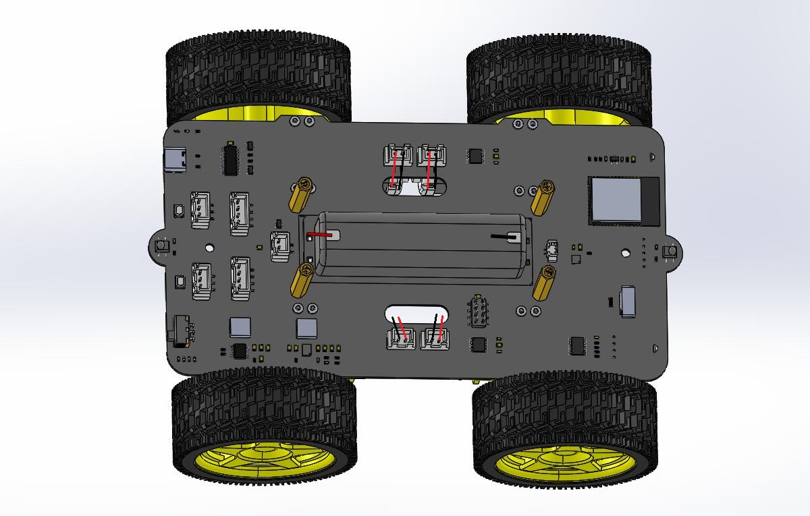

# Assembly_tutorial  
-------------------
```{note}
After unpacking the product, the product has its own factory program, which can be used to assemble the product, please do not burn the program to the motherboard before assembly!     
If you have burned other programs to the motherboard, please refer to the ["Restore Factory Functionality"](../restore_factory_function/restore_factory_function.md) section to burn factory programs!  
```             

Step1
-----    
Prepare tools and components:
| PCB board | TT motors 4Pcs | Motor bracket 4Pcs |     
| :--: | :--: | :--: |    
|  |  |  |   
| M1.6x6mm screw 16Pcs | Screwdriver |  |
|  |  |  |

Assembly process:     
| The four motors were fixed to the PCB with M1.6 screws. |     
|:-:|       
|  |    
| The image after installation. |    
|  | 
| Motor wiring. |
| |   

Step2
----- 
Prepare components:
| Step1 Install the finished part. | Wheels 4Pcs |       
| :--: | :--: |           
|  |  |     

Assembly process:     
| Insert the 4 wheels into the motor shaft. |     
|:-:|       
|  |    
| The image after installation. |    
|  | 

Step3
----- 
Prepare tools and components:     
| Step2 Install the finished part. | Cell box | 3Mx30mm copper pillars 4Pcs |       
| :--: | :--: | :--: |           
|  |  |  |    
| M3X8MM screw 4Pcs | Screwdriver | |   
|  |  |  |

Assembly process:     
| Fix the battery box to the PCB. |     
|:-:|       
|  |    
| The image after installation. |    
|  | 

Step4
----- 
Prepare components:
| Step3 Install the finished part. | Speaker |        
| :--: | :--: |           
|  |  |      

Assembly process:     
| Remove the sticker on the back of the speaker and stick the speaker to the battery case. |      
|:-:|       
|  |     
| The image after installation. |    
|  |     
| Speaker wiring. |
| |  

Step5
----- 
Prepare tools and components:      
| Acrylic board | Servo | M2x8mm screw 2Pcs |      
| :--: | :--: | :--: |               
|  |  |  |        
| M2 Nut 2Pcs | Screwdriver | |   
| | |  |

Assembly process:     
| Fix the servo to the acrylic plate. |      
|:-:|       
|  |     
| The image after installation. |    
|  |     
| Servo wiring. |
| |      

Step6
----- 
Prepare tools and components:      
| Ultrasonic module | Ultrasonic module bracket | M1.6x6mm screw 4Pcs |      
| :--: | :--: | :--: |               
|  |  |  |        
| M1.6 Nut 4Pcs | Screwdriver | |   
| |  | |

Assembly process:     
| Fix the ultrasonic module on the bracket. |      
|:-:|       
|  |     
| The image after installation. |    
|  |   

Step7
----- 
Prepare tools and components:      
| Step4 Install the finished part. | Step5 Install the finished part. | Step6 Install the finished part. |          
| :--: | :--: | :--: |                   
|  |  |  |          

Assembly process:     
| Before assembling the two parts, the wires of the servo and ultrasonic module should be connected. |      
|:-:|       
|  |    
| Assemble the two parts. |    
|  |    
| The image after installation. |    
|  |  

Finally, check that the wiring is correct.
 

Step6
----- 
Prepare tools and components:      
| Step5 Install the finished part. | Servo shaft bracket | M1.6x6mm screw 1Pcs |      
| :--: | :--: | :--: |               
|  |  |  |        
| Screwdriver | | |   
|  | | |

Assembly process:     
| Fix the bracket on the servo shaft. |      
|:-:|       
|  |     
| The image after installation. |    
|  | 


Step8
----- 
Prepare tools and components:      
| Step6 Install the finished part. | Step7 Install the finished part. |          
| :--: | :--: |                  
|  |  |          

Assembly process:     
| Fix the ultrasonic module bracket on the servo bracket. |      
|:-:|       
|  |     
| The image after installation. |    
|  | 