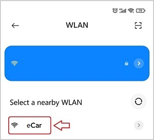

# Play eCar          
-----------
```{tip}
eCar factory default burning Arduino web app code, you can control it through the mobile browser after installing eCar!     
```    
     
eCar factory default code can be controlled in two ways: IR remote control and Web app control.     

## IR remote control       
--------------------
1. Turn the power switch ON the eCar to the "ON" state.     
   
2. <a href="https://docs.mosiwi.com/en/latest/outsourcing/nec_ir_remote_control/nec_ir_remote_control.html#cr2025-3v-lithium-manganese-battery" target="_blank">Make sure the infrared remote control has batteries installed.</a>      

3. Now you can control mCar!    
       

| Button | Function |    
| :--: | :-- |  
| 0 - 9 | Play different songs. |   
| # | Play or pause the song. |       
| * | Turn on or off the LED light. |       
| ▲ | Forward |      
| ▼ | Backward |      
| ◀ | Turn left |    
| ▶ | Turn right |    
| OK | Stop |    

## Web app control     
------------------
1. Turn the power switch ON the eCar to the "ON" state.    

2. The phone searches and connects to mCar's wifi.       
     
 
```{tip}
After connecting to Wifi, your phone may pop up a window saying it cannot connect to the network, please ignore it!          
``` 

3. Open your phone's browser and link to it by typing **"192.168.4.1"** in the address bar.    
      

```{note}
You must turn off the mobile data of your phone, or you may not be able to open the website!      
``` 


4. The following screen should appear in your browser, and now you can control mCar!     
    

| Button | Function |    
| :--: | :-- |
| Left display window | Displays the name of the song. |  
| Right display window | Display the distance measured by the ultrasonic module. |     
| P: xxx% | Displays the battery level. |    
| F | Press the button, the car forward; Release the button and the car stop. |   
| B | Press the button, the car backward; Release the button and the car stop. |  
| L | Press the button, the car turn left; Release the button and the car stop. |  
| R | Press the button, the car turn right; Release the button and the car stop. |  
| P | Press the button, the horn will sound; release the button and the horn will stop. |     
| Speed | Adjust the speed of the car. |   
| Light | Adjust the brightness of the LEDs. |     
| Aservo | Adjust the Angle of the ultrasound. | 
| Bservo | Reserved, if the servo2 interface is connected to the servo, its Angle can be controlled. |   
| Volt +/- | Control the volume of the speaker. |   
| < | Returns the last song. |  
| \|\|< | Play or pause the song. | 
| > | Switch to the next song. | 
| A | Turn RGB LED flashing on or off. | 
| S | Turn on or off the ultrasonic measuring distance. | 
| C | Reserve | 


--------
**End!**    


