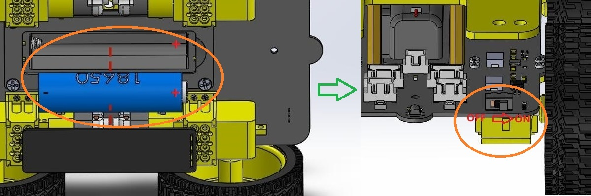
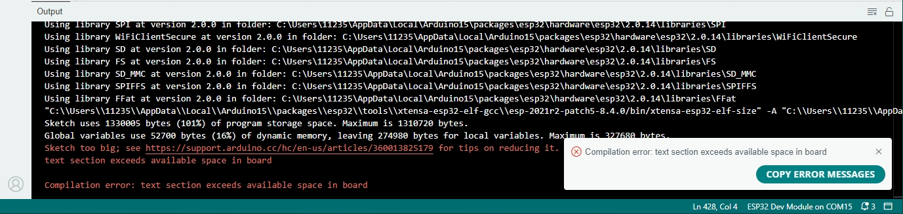
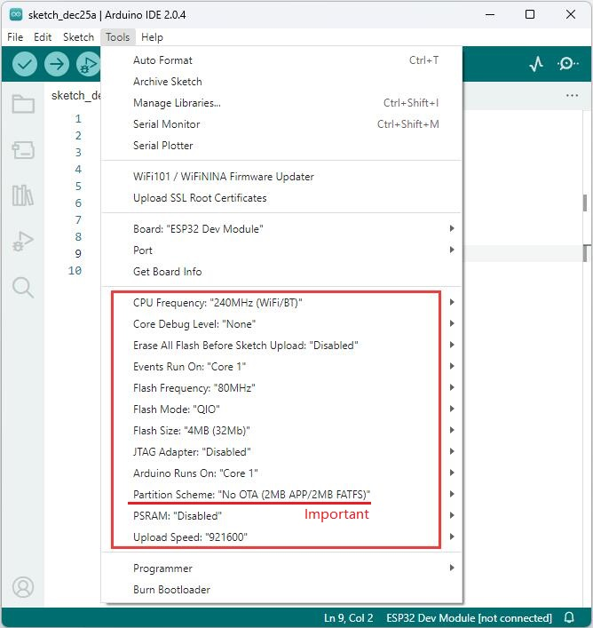
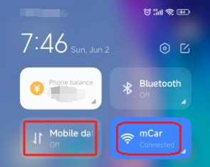

# QA    
----------

## Not working ?   
---------------- 
1. Make sure the battery is properly installed and fully charged.    
2. Make sure the power switch on the shield is turned to "ON".  

## The USB port cannot be identified ?    
--------------------------------------
1. Ensure that the USB cable with data communication function is used or another USB cable with communication function is used for testing.    
2. Make sure the USB driver is installed.       
3. After the driver is installed, you must install the appropriate battery and turn the eCar power switch on, otherwise you will not find the COM port!               
                  

## Arduino IDE Upload code failed?            
----------------------------------       
           
1. Make sure that the Arduino IDE is set to the correct parameters, as shown below:          
          

## IR remote control does not work?
----------------------------------------------------------------    
1. <a href="https://docs.mosiwi.com/en/latest/outsourcing/nec_ir_remote_control/nec_ir_remote_control.html#notes" target="_blank">IR remote control</a>    

## Can't open the control page on your phone ?  
-------------------------
1. The phone must turn off mobile data and link to eCar's WiFi.   

## Unable to play music ?  
-------------------------
1. Make sure that the SD card is inserted into the SD card holder of eCar.     

## How to check the good or bad of the components ?      
---------------------------------------------------  
1. Sample code for all the components is provided in the code of the kit, and you can verify the good and bad of the components.     

