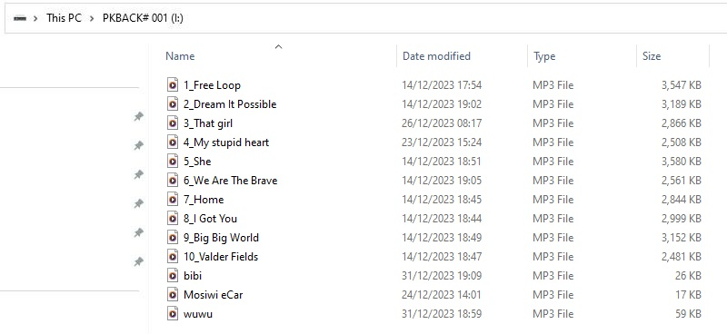

# Restore factory function          
--------------------------
eCar in the factory has burned a multi-function code, and SD card stored in some songs, if you lost them, according to the following method can restore them!             

## Restore factory code         
-----------------------
1. Download bin files: [Click me to download!](../_static/restore_factory_function/bin/ecar_bin.zip)    

2. Install the CH340 driver: <a href="https://docs.mosiwi.com/en/latest/various_resources/ch340/ch340_driver.html" target="_blank">Link</a>
```{tip}
If you've already done this step, you can skip it!           
``` 

3. Download the burning tool: <a href="https://www.espressif.com.cn/en/support/download/other-tools" target="_blank">Link</a>       
       

4. Start the burn tool and burn bin files downloaded above into eCar as follows:           
   
```{note}
The CH340 driver must be installed, otherwise the COM port cannot be found!              
``` 

## Recover the songs in the SD card   
-----------------------------------
1. Download the song file and unzip it: [Click me to download!](../_static/music/ecar_music.rar)    

2. Copy the music downloaded in the previous step to the root directory of your SD card, as follows:         
              

```{tip}
You need to use the SD card reader!                   
``` 

     

Now insert the SD card into the eCar and start the eCar to remote control it: [Link](../play_ecar/play_ecar.md)

--------
**End!**    


